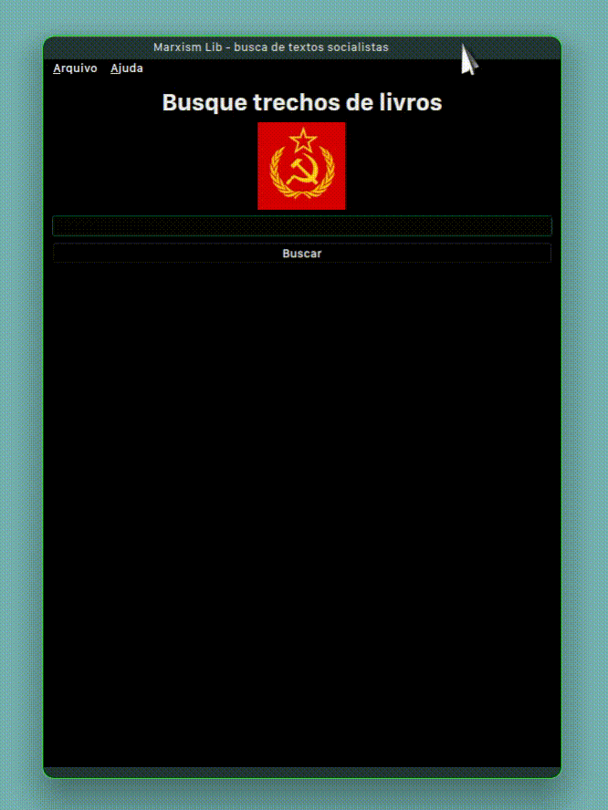

### Marxism Lib

#### Nome do Projeto: Marxism Lib

#### Versão: Alpha 0.1

#### Descrição Geral:

Marxism Lib é um simples software que tenta juntar textos de livros para ficar mais fácil, ele tenta ajudar estudantes e entusiasta em geral na pesquisa de textos de livros, além disso ele pode servir de base para desenvolvimento de outros software.

#### Licença:

GPL v3

#### Tecnologia:

A tecnologia usada é Python com a biblioteca PySide 6

#### Status Atual

Atualmente o software está em fase alpha, pequenos bugs e limitações podem ocorrer, mas a maioria das funcionalides estão pegando

#### Contribuições:

Encorajamos a todos a contribuir com o projeto para que possa ter um melhor desenvolvimento.
